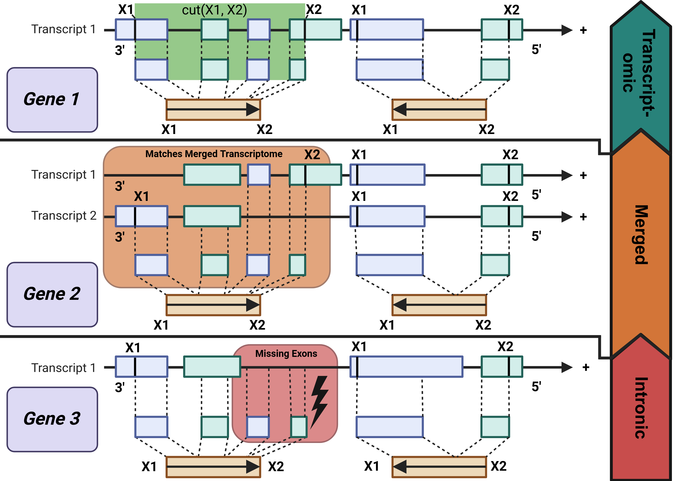

# Genomorientierte Bioinformatik Assignment 3
## Bam Features
`Sequencing` in bioinformatics generates **billions** of `reads` per sample, which are aligned to the `reference genome` using a `mapper`.
These data are stored in a `Sequence Alignment Map (SAM)` file and can be converted into a compressed format, a `Binary Alignment Map (BAM) file`.
Various analyses can then be performed on the BAM files.

The `JAR` discussed in this report reads a given `paired-end RNA-seq BAM file` and calculates various features, which are stored in a `<tsv> `file.
The `JAR` was executed on `three different BAM` files to compute `RPKM` values. 
Additionally, the `JAR` is analyzed in terms of `runtime` and `correctness`.

See [Report](./report/bamfeatures.pdf)

## Usage
```sh
java -jar bam.jar 
          -bam <bamPath.bam> 
          -o <outputPath.annot> 
          -gtf <gtfPath.gtf> 
          [-frstrand <true/false>] 
          [-lengths]
```

## Used Bam FIles
| Species       | BAM         | GTF        | frstrand     |
| ------------- | ----------- | ---------- | ------------ |
| Homo Sapiens  | ebna_hisat  | GRCh37.75  | "+"/"true"   |
| Homo Sapiens  | hes_star    | GRCh37.75  | "-"/"false"  |
| Yeast         | nookaew_cm  | R64-1-1.75 | $\cross$     |


## Read Pair Classification


> [!NOTE]   
>
> [BioRender](https://www.biorender.com/) was used to create this figure.

## Runtime


## RPKM Calculation
```sh
bash rpkm.sh <sample>.annot <sample>.gene_lengths.txt
```

> [!NOTE]   
>
> <sample>.gene_lengths.txt is generated when calling the `JAR` with the `-lengths` flag.
